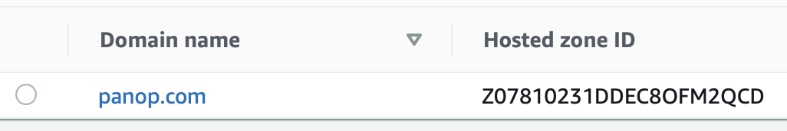
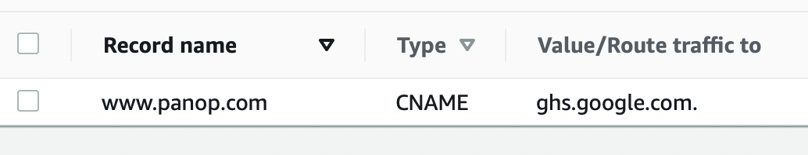
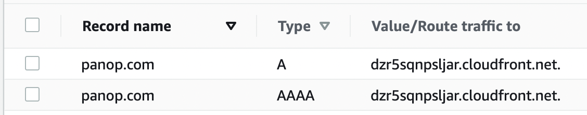

WWW Redirector Template
=======================

This template requires a pre-existing route53 domain which has no top-level A or AAAA record.  It takes two parameters:
 - `DomainName` the name of the domain in route53
 - `Route53HostedZoneId` the HostedZoneId of the domain in route53

It will then create a bucket in S3 called `DomainName` with no content, and enable web serving on that bucket; this will redirect http://`DomainName`/* -> https://`DomainName`/*

It will also then create an SSL certificate (which it will automatically confirm by injecting appropriate Route53 records via a lambda that it creates), and set up a Cloudfront distribution for the S3 bucket, configuring that formation to route all requests to https://www.`DomainName`/*.  It then enters A and AAAA alias records in route53 pointing to the Cloudfront distribution.

Effectively, this means that the entire stack will re-route all HTTP and HTTPS requests for `DomainName` to `www.DomainName`.  This is useful when you are hosting a website externally, for example on Google Sites or such, and you can create a CNAME record for www.`DomainName` but can't CNAME the TLD; instead, we use AWS's free-tier (assuming low volume on the redirects) to redirect from the TLD to the www site.

Example
-------

So I have the following existing Route53 setup:

I would like https://panop.com/ and http://panop.com/ to both get redirected to that site. But I cannot create a CNAME for the TLD because you can't/shouldn't CNAME a TLD.

So I run this CF template, and give it the domain name and Hosted zone ID, and lo!:

Now all my requests work!
